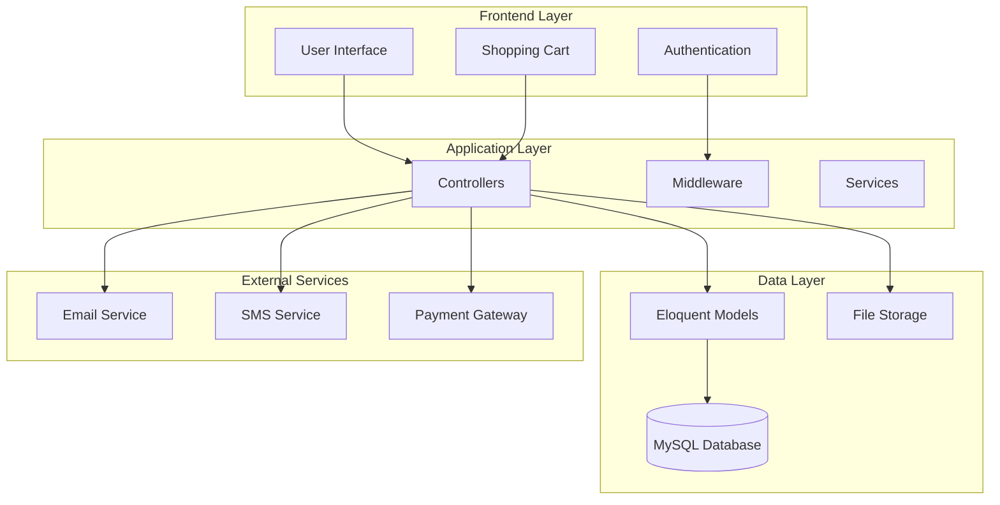
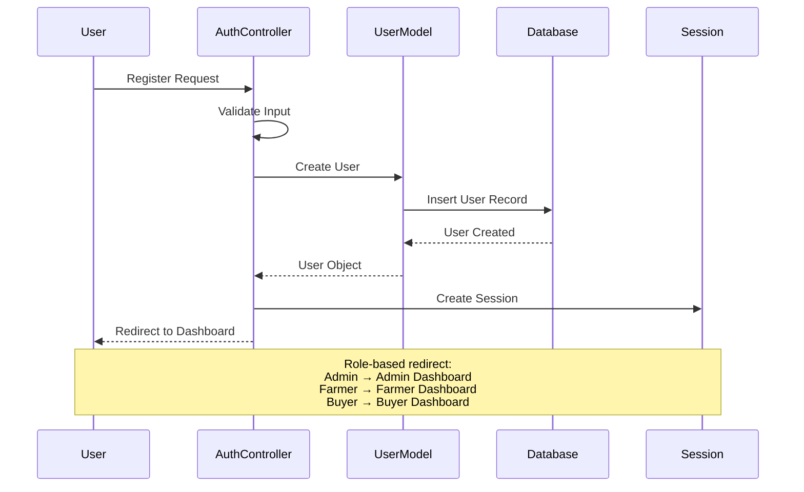
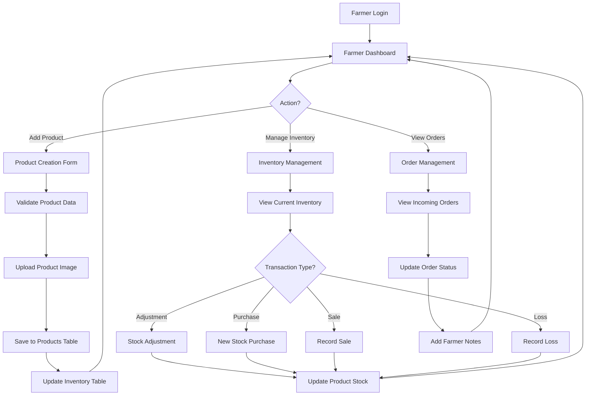
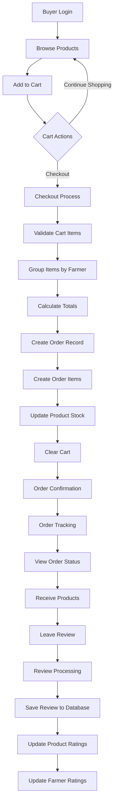
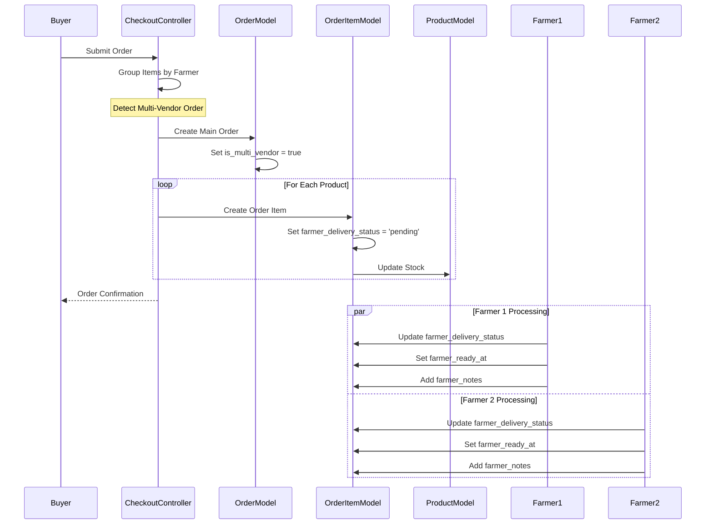
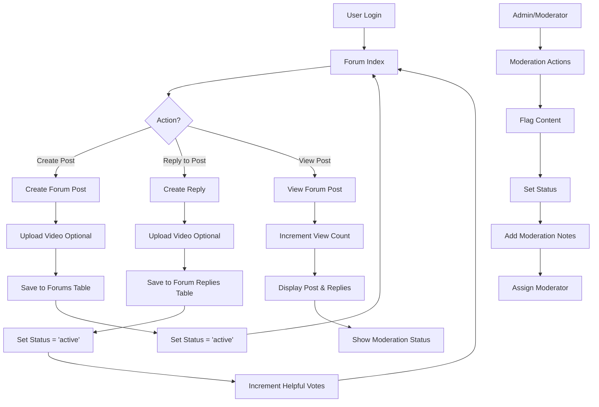
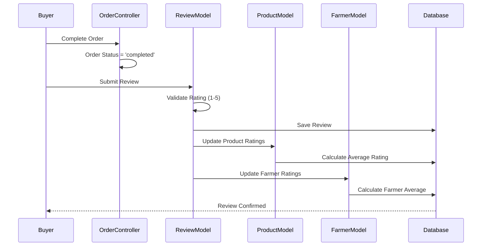
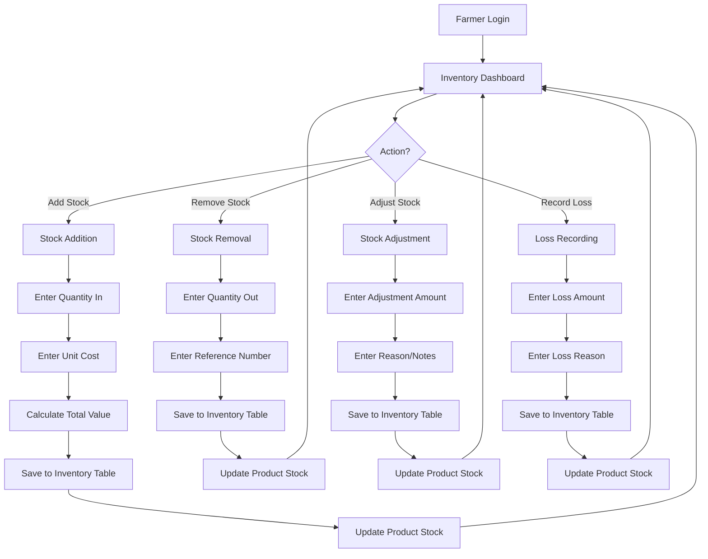
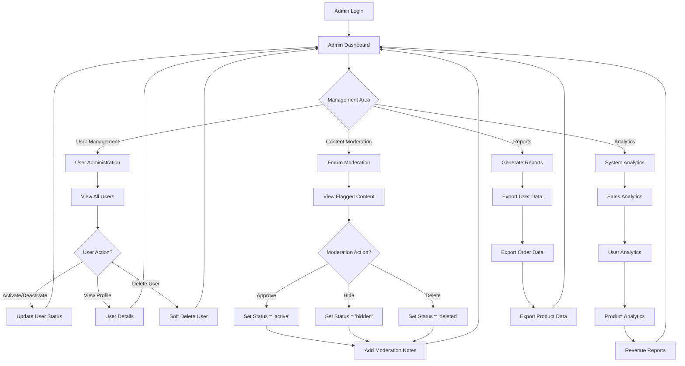

# E-Tinda Marketplace - Dataflow Diagram

## Overview
This document illustrates the data flow patterns and system interactions within the E-Tinda Marketplace platform. The system supports three main user types (Admin, Farmer, Buyer) with distinct workflows and data interactions.

## System Architecture Overview



## User Registration & Authentication Flow



## Product Management Flow (Farmer)



## Shopping & Order Flow (Buyer)



## Multi-Vendor Order Processing



## Forum System Flow



## Review & Rating System Flow



## Inventory Management Flow



## Admin Management Flow



## Data Flow Patterns

### 1. User Registration Flow
```
User Input → Validation → Password Hashing → Database Insert → Session Creation → Role-based Redirect
```

### 2. Product Creation Flow
```
Farmer Input → Image Upload → Validation → Database Insert → Inventory Record → Stock Update
```

### 3. Order Processing Flow
```
Cart Items → Farmer Grouping → Order Creation → Order Items → Stock Deduction → Confirmation
```

### 4. Multi-Vendor Order Flow
```
Mixed Cart → Farmer Detection → Main Order → Individual Items → Farmer Notifications → Status Tracking
```

### 5. Review Submission Flow
```
Order Completion → Review Form → Rating Validation → Database Insert → Rating Calculations → Notifications
```

### 6. Inventory Transaction Flow
```
Transaction Input → Validation → Inventory Record → Stock Calculation → Product Update → Reporting
```

### 7. Forum Content Flow
```
User Post → Content Validation → Video Upload → Database Insert → Moderation Queue → Publication
```

### 8. Content Moderation Flow
```
Flagged Content → Admin Review → Status Decision → Moderation Notes → User Notification
```

## Key Data Relationships

### Primary Data Flows
1. **User → Products → Orders → Reviews**
2. **Farmer → Inventory → Stock Updates → Reports**
3. **Buyer → Cart → Orders → Reviews → Ratings**
4. **User → Forums → Replies → Moderation**

### Cross-Entity Flows
1. **Order Items → Farmer Status Updates**
2. **Reviews → Product/Farmer Rating Updates**
3. **Inventory → Product Stock Synchronization**
4. **Forum Posts → User Activity Tracking**

## System Integration Points

### External Service Integrations
- **Email Service**: Order confirmations, notifications
- **SMS Service**: Delivery updates, alerts
- **Payment Gateway**: Order processing, refunds
- **File Storage**: Product images, forum videos

### Internal Service Dependencies
- **Authentication Service**: All user interactions
- **Session Management**: User state persistence
- **File Management**: Image/video uploads
- **Notification Service**: User communications

## Performance Considerations

### Database Optimization
- Indexed foreign keys for fast lookups
- Composite indexes for multi-column queries
- Date-based indexes for time-series data

### Caching Strategies
- Session-based cart storage
- Product image caching
- User profile caching

### Scalability Patterns
- Pagination for large datasets
- Lazy loading for related data
- Background job processing for heavy operations

This dataflow diagram provides a comprehensive view of how data moves through the E-Tinda Marketplace system, showing the interactions between different user types, system components, and data entities.

